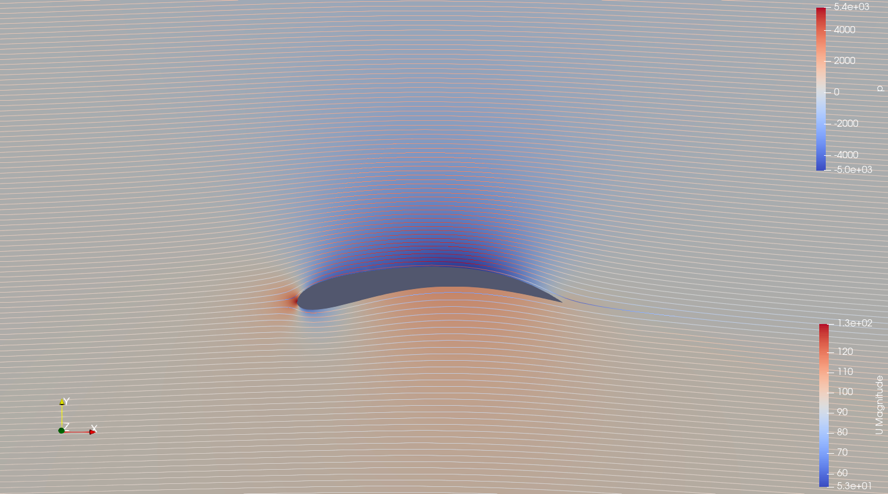

# OpenFOAM airfoil optimization 


## Overview 

This is a simple set of code that automatically finds airfoils, optimizing for the lift-to-drag ratio $C_l / C_d$. It does this by generating an airfoil shape based on six CST-parameters (courtesy of [this repo](https://github.com/Ry10/Kulfan_CST/)). An initial attempt to create a variable meshing code myself with `blockMesh` turned out to be very painful, so the meshing is handled by [curiosityFluids' excellent mesher](https://github.com/curiosityFluids/curiosityFluidsAirfoilMesher) ([blog post](https://curiosityfluids.com/2019/04/22/automatic-airfoil-cmesh-generation-for-openfoam-rev-1/)) 

The simulation is then ran. If any issues are encountered with the meshing, `blockMesh`, or `simpleFoam`, the code returns $+\infty$. For $C_l / C_d$, any value is considered feasible, even negative ones - that turns out to generally be the code inventing upside-down airfoils. The case is essentially symmetric at $0^\circ$ angle-of-attack, so this is not penalized. The value to optimize is taken as $|C_l / C_d|$. 

SciPy's [differential evolution](https://docs.scipy.org/doc/scipy/reference/generated/scipy.optimize.differential_evolution.html) is taken as an optimization algorithm. It's far slower than other methods, but using a global optimizer here seems like the better choice. Other gradient-free algorithms like Nelder-Mead also found reasonable airfoils and were much faster, however. 

The result is a CSV containing airfoil parameters and their performance. These can be further post-processed with ParaView. 

## Features 

### Parallel-processing 

The code uses an OpenFOAM template folder, which is repeatedly copied into several directories, using UUIDs as names. Relevant parameters are then entered into these templates (such as the adjusted `blockMesh`, and `U`) As soon as a case completes (either because of errors, or because it correctly finished), the folder is deleted. 

### Automatic top-n selection and rendering  

The code can post-process the top-n highest scoring airfoils so far, simulating each of them. The results can subsequently be rendered with a ParaView Python macro. First, run 

```python main.py --custom```

This places the top-n runs under `custom_runs`. Follow this by 

```python src/post_processing/post_process.py``` 

If all goes well, this places all the results under `results/renders`. 



The latter isn't entirely reliable: ParaView includes its own Python-distribution based on Python 3.10. If you encounter errors here, it's best to either look at the code, or open each `.foam` under `custom_runs` individually. 

### Analysis 

The repo includes an analysis-notebook. This tracks performance over time, and allows for selection of the best-performing airfoils. 


## Future steps 

### $C_l/C_d$ curves 

I have added some basic angle-of-attack (AoA) formats already to the OpenFOAM templates. The next step will be to pick the best-performing airfoils, and simulate a range of angles for them, then analyze the lift and drag performance. The same can then be done for different velocities, to obtain estimates of the window of operation per airfoil before stall etc. occurs. 

### Model reduction 

I am curious about potential model reduction: by predicting performance based on the six inputs, a lot of time could be saved. If a rough prediction on which airfoils perform best is accurate, a simple machine learning model like random forests could be used for an initial optimization stage. I doubt a simple model like this would be sufficient, but it's an interesting avenue to explore. 

